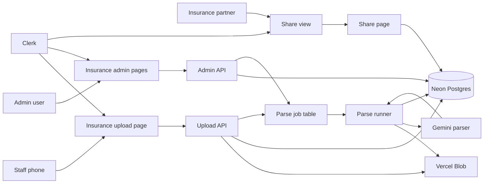

# Maadan Yatra

Small internal app for tour quotes and insurance form work.

## Why

Staff need one place to make quotes, upload insurance papers, check the
machine-read data, and share only the final fields with insurance partners.

## What

- Quotes: create and view trip quotes.
- Insurance upload: staff add photos or PDF files for Aadhaar and purchase slips.
- Insurance admin: admins check the parsed data, edit it, and mark it verified.
- Share view: partners sign in and see only the cases and fields shared with them.

## Shape

- Next.js app router for pages and API routes.
- Clerk for sign in.
- Neon Postgres with Prisma.
- Vercel Blob for private document files.
- Gemini for document parsing.
- Pino logs with trace ids for upload, parse, admin, and share work.

## Architecture



## Local Work

```bash
npm install
npm run prisma:migrate
npm run dev -- -p 3000
```

Open:

```text
http://127.0.0.1:3000
```

Useful checks:

```bash
npm run build
npx prisma migrate status
```

If dev ports are stuck:

```bash
ss -ltnp '( sport = :3000 or sport = :3001 or sport = :3002 or sport = :3003 )'
```

## Deploy

Use Vercel for the app.

1. Add the env keys below in Vercel.
2. Deploy the branch.
3. Run database migrations against the target Neon database:

```bash
npx prisma migrate deploy
```

4. Sign in with an email from `CLERK_ADMIN_EMAILS`.
5. Upload a test insurance case, parse it, verify it, then share it with a test
   partner email.

## Env Keys

Required:

```bash
DATABASE_URL=
NEXT_PUBLIC_CLERK_PUBLISHABLE_KEY=
CLERK_SECRET_KEY=
BLOB_READ_WRITE_TOKEN=
GEMINI_API_KEY=
CLERK_ADMIN_EMAILS=
```

Optional:

```bash
GEMINI_MODEL=
LOG_LEVEL=info
LOG_TO_FILE=false
```

Notes:

- `CLERK_ADMIN_EMAILS` is a comma-separated list.
- Vercel Blob may set `BLOB_READ_WRITE_TOKEN` for you if the Blob store is linked.
- Keep `DATABASE_URL` pointed at the right Neon branch for the environment.
